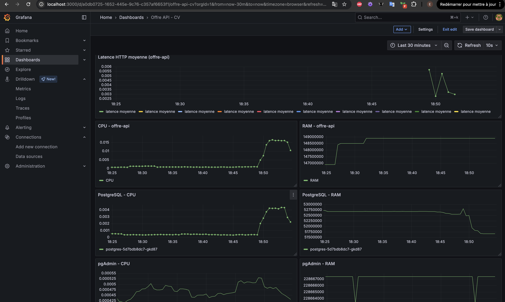
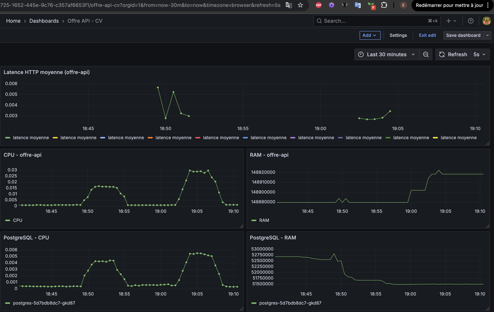
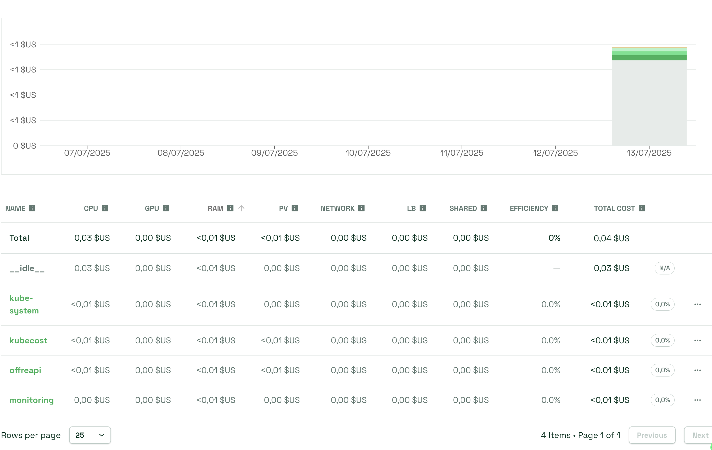

# FinOPS-APP

Lien du projet GitHub : [https://github.com/Clement-tc/APP\_AUTO/tree/main](https://github.com/Clement-tc/APP_AUTO/tree/main)

## OffreAPI - Dashboard de Recrutement avec Analyse FinOps

### Présentation du projet

OffreAPI est une application web développée en Flask permettant aux recruteurs de publier des offres d'emploi et de visualiser, pour chaque offre, un dashboard de scoring sémantique entre les CV soumis et la description du poste.

Un modèle LLM était initialement prévu pour effectuer le scoring, mais en raison de contraintes de mémoire (OOM sur Kubernetes), une simulation avec `numpy.random.uniform` est utilisée pour reproduire la logique de classement des candidats.

Le projet intègre aussi un monitoring avec Prometheus et Grafana, ainsi qu'une analyse FinOps avec Kubecost.

---

## Stack technique et infrastructure

L’application repose sur Flask (avec SQLAlchemy pour l’ORM), et utilise PyMuPDF pour l’extraction de texte des CV. Les données sont stockées dans une base PostgreSQL. L’environnement est conteneurisé avec Docker, et orchestré via Kubernetes. La supervision est assurée par Prometheus et Grafana, tandis que Kubecost fournit une estimation des coûts pour chaque composant du cluster.

Le monitoring de l’application repose sur l’export de métriques via un endpoint `/metrics`, intégré à Flask grâce à Prometheus Flask Exporter. L’infrastructure est déployée sur Minikube, avec un script bash d’automatisation. Une intégration CI/CD via Jenkins est prévue pour industrialiser le déploiement.

---

## Explication des manifests Kubernetes

Tous les fichiers de configuration nécessaires au déploiement sont stockés dans le dossier `k8s/`. Chaque composant est défini dans un manifest distinct : l’application Flask, PostgreSQL, pgAdmin, ainsi que les éléments liés au monitoring (ServiceMonitor, secrets, config). Ces fichiers définissent aussi les `requests` et `limits` pour le suivi FinOps. Les ressources sont isolées dans le namespace `offreapi`, à l’exception du monitoring qui peut être déployé dans un namespace `monitoring`.

---

## Déploiement Kubernetes

Le déploiement s’effectue localement via Minikube. Après démarrage du cluster, on construit et pousse l’image Docker de l’application. Ensuite, le namespace `offreapi` est créé, puis l’ensemble des fichiers `k8s/` est appliqué pour créer les pods et services nécessaires.

Voici les commandes de base utilisées :

```bash
minikube start
docker build -t elcer/offre-api .
docker push elcer/offre-api
kubectl create namespace offreapi
kubectl apply -f k8s/
kubectl get pods -n offreapi
```

L’application est ensuite accessible via NodePort ou port-forward. Prometheus scrape les métriques exposées par l’API Flask via un ServiceMonitor. Grâce aux `requests` définis dans les manifests, il est possible de suivre la consommation réelle des pods dans Grafana et Kubecost.

---

## Dashboards de monitoring Grafana

Avant un afflux important de trafic, le tableau de bord montre une consommation faible des ressources, avec une latence moyenne basse et une faible utilisation CPU/RAM.



Après une simulation de charge, on observe une élévation significative des métriques, traduisant l’impact de la montée en charge sur les composants (API Flask, base PostgreSQL, pgAdmin).



---

## Analyse FinOps avec Kubecost



Grâce à Kubecost, nous avons pu simuler les coûts d’utilisation mensuels de chaque composant déployé. Les paramètres utilisés sont personnalisés :

* CPU : 0.02 € par vCPU par heure
* RAM : 0.01 € par Go par heure
* Stockage : 0.03 € par Go par mois

Cela permet de détecter les cas de surprovision, comme une `request` CPU trop élevée par rapport à l’usage réel. Des optimisations sont alors possibles : ajuster les `requests`, réduire les réplicas, ou modifier le type d’image (par exemple utiliser Alpine ou Python slim).

---

## Fonctionnalités principales

L’application offre aux recruteurs la possibilité de publier des offres d’emploi, et aux candidats de postuler via dépôt de CV PDF. Le texte est extrait automatiquement, puis une logique de scoring (simulée ici) permet d’analyser la pertinence des profils. Chaque offre dispose d’un dashboard dédié avec graphique des scores.

L’ensemble est supervisé en continu via Grafana, avec un suivi des métriques Prometheus. Le coût estimé de chaque pod est visualisable via Kubecost, offrant une analyse FinOps précise et exploitable pour des recommandations concrètes.
